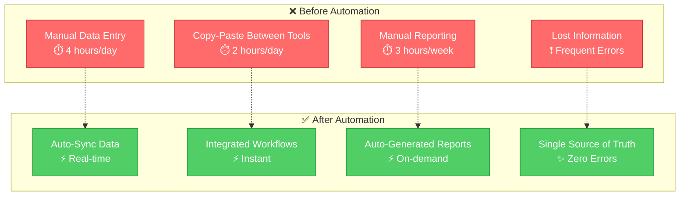
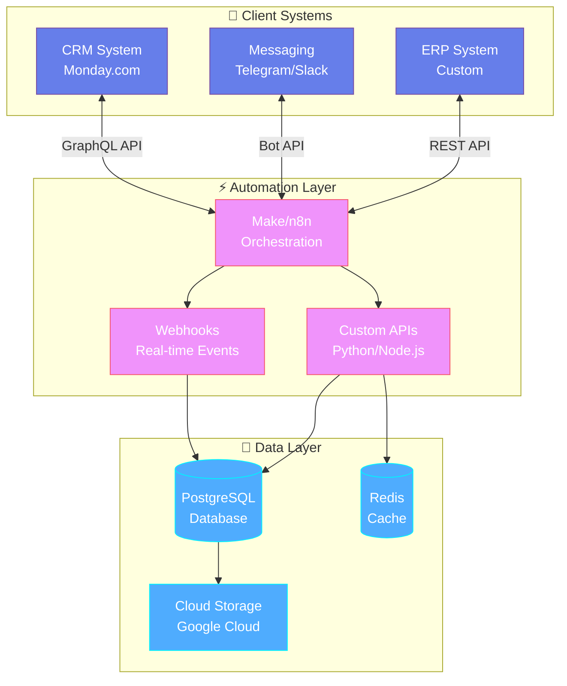

<div align="center">

# 👋 Hi, I'm a Business Process Automation Specialist

### 🔗 Connecting SaaS Tools | 🤖 Building Smart Workflows | ⚡ Minimizing Manual Work

[](https://t.me/solarezzov)
[](mailto:marksolarezz@gmail.com)


</div>

---

## 🎯 About Me

```typescript
const automationSpecialist = {
    role: "Business Process Automation Specialist",
    experience: "2+ years in commercial automation & integrations",
    philosophy: "80% Visual Constructors + 20% Custom Code",
    approach: "I'm not a classical developer - I'm a solution architect",
    focus: "Connecting SaaS tools into unified business processes with minimal code",
    superpower: "Understanding business logic and implementing it technically - fast"
};
```

I bridge the gap between business needs and technical implementation using low-code/no-code platforms. My expertise lies in creating robust, scalable automation solutions that save time and eliminate routine tasks.

---

## 🛠️ Technology Stack

### 🚀 Main Automation Platforms


### 💻 Programming & Databases


### 🔌 APIs & Integrations


**And many more:** HouseCall Pro API, ServiceTitan API, Kommo API, and 30+ other integrations

### ⚙️ Infrastructure & Tools


---

## 🎨 My Automation Approach


### 📋 Workflow Breakdown

| Phase | Focus | Tools Used |
|-------|-------|------------|
| **1. Analysis** | Understanding business requirements and pain points | Flowcharts, Process Mapping |
| **2. Selection** | Choosing optimal low-code platform for the task | Make, n8n, Zapier, Retool |
| **3. Development** | Building the automation (80% visual, 20% code) | Visual Builders + Custom Scripts |
| **4. Testing** | Ensuring reliability and error handling | Test Scenarios, Edge Cases |
| **5. Documentation** | Creating clear guides for maintenance | Markdown, Video Guides |

---

## 💎 My Automation Principles

<table>
<tr>
<td width="50%">

### 🎯 Minimal Code Philosophy
```
Visual Constructors: ████████░░ 80%
Custom Code:        ██░░░░░░░░ 20%
```
**Maximize** no-code tools  
**Minimize** custom development  
**Optimize** for maintainability

</td>
<td width="50%">

### 🛡️ Reliability First
```python
def automation():
    try:
        # Idempotent operations
        # Proper error handling
        # Comprehensive logging
        return "Success"
    except Exception as e:
        notify_admin(e)
        retry_with_backoff()
```

</td>
</tr>
<tr>
<td width="50%">

### 📈 Scalability from Day One
- **Modular Architecture** - Easy to extend
- **Rate Limit Handling** - Avoid API throttling
- **Queue Management** - Process large volumes
- **Monitoring** - Real-time alerts

</td>
<td width="50%">

### 📚 Documentation & Transparency
- ✅ Visual flowcharts for every integration
- ✅ Step-by-step setup guides
- ✅ Error handling documentation
- ✅ Maintenance instructions
- ✅ Knowledge transfer sessions

</td>
</tr>
</table>

---

## 🚀 What I Offer to Businesses

<div align="center">

| Service | Impact | Example Use Cases |
|---------|--------|-------------------|
| 🔄 **SaaS Integration** | Connect your tools seamlessly | CRM ↔️ Email ↔️ Slack ↔️ Database |
| 🤖 **Chatbot Development** | Automate customer & internal support | Telegram bots, Slack bots, WhatsApp |
| 📊 **Process Automation** | Eliminate manual data entry | Auto-sync between platforms |
| 🔔 **Monitoring & Alerts** | Stay informed in real-time | Business metrics, error notifications |
| ⚡ **Workflow Optimization** | Speed up existing automations | Review & improve current setups |

</div>

### 📉 Before & After Automation



**Average Results:**
- ⏱️ **70-80% time saved** on routine operations
- ❌ **95% reduction** in human errors
- 📈 **3x faster** data processing
- 💰 **ROI achieved** within 2-3 months

---

## 📊 GitHub Statistics

<div align="center">


</div>

---

## 🌟 Integration Architecture Example



---

## 💬 What Clients Say

> *"The automation reduced our data entry time from 4 hours to 15 minutes daily. The ROI was immediate and the solution is rock-solid."*  
> **— Operations Manager, SaaS Company**

> *"Professional approach, clear documentation, and ongoing support. Our team can now focus on strategic work instead of routine tasks."*  
> **— CEO, Digital Agency**

---

## 📬 Let's Automate Your Business!

<div align="center">

### 🚀 Ready to eliminate routine and scale your operations?

**Let's discuss how I can help you save time and reduce manual work!**

<br/>

[](https://t.me/solarezzov)
[](mailto:marksolarezz@gmail.com)

<br/>

---

### 🎯 Quick Stats


---

<sub>⭐ If you find my work interesting, consider starring my repositories!</sub>

</div>

---

<div align="center">

**💡 "The best automation is the one you don't notice is running"**


</div>
